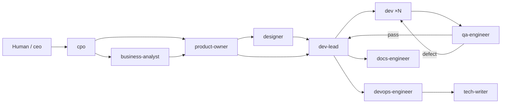

# AITeam

**An AI company, built as a team of Claude Code subagents.**

Fifteen employees. Zero salaries. Zero HR complaints. Zero snack budget disputes.
Each role is a subagent definition in [`.claude/agents/`](.claude/agents/): a scoped
set of tools, a model tier matched to how much damage the role could do if it went
rogue, and a system prompt that says what it owns, what it hands off, and what it must
never, ever touch (looking at you, intern-tier haiku models).

The whole org chart reports, ultimately, to you — the one human in this building who
still has to pay for tokens.

## The team

| Role | Subagent | Model | Owns |
|---|---|---|---|
| CEO | `ceo` | opus | Vision, routing, and taking credit in standups |
| CTO | `cto` | opus | Architecture decisions, tech strategy, ADRs nobody reads |
| CPO | `cpo` | opus | Roadmaps that change every sprint |
| CFO | `cfo` | sonnet | Saying "no" to paid services, professionally |
| Business Analyst | `business-analyst` | sonnet | Turning "it depends" into actual requirements |
| Product Owner | `product-owner` | sonnet | Turning vibes into acceptance criteria |
| Dev Lead | `dev-lead` | sonnet | Splitting work up, reviewing it, judging you for it |
| Developer | `dev` | sonnet | Actually writing the code (novel concept) |
| QA Engineer | `qa-engineer` | sonnet | Finding the bug in the bug fix |
| DevOps Engineer | `devops-engineer` | sonnet | CI/CD, and being blamed when it's red |
| Security Engineer | `security-engineer` | sonnet | Saying "no" to everything, professionally |
| Designer | `designer` | sonnet | Pixels, tokens, and gentle rage at engineering |
| Support Engineer | `support-engineer` | haiku | Reading the same bug report five times |
| Technical Writer | `tech-writer` | sonnet | Documenting features before everyone forgets they exist |
| Documentation Engineer | `docs-engineer` | sonnet | Keeping the architecture docs from lying to you |

A "team" is one definition invoked as many times as there are parallel tasks — three
`Agent` calls to `dev` is three developers, not three files. Yes, this means the
company can hire an infinite number of developers instantly and still ship late.

## How work flows



`cpo` routes to `business-analyst` only for initiatives with genuinely unclear
requirements — narrow, well-understood asks go straight to `product-owner`.
`docs-engineer` picks up architecturally-significant merges to keep the codebase's
own docs honest; it doesn't gate the release the way `qa-engineer` does.

Support tickets enter through `support-engineer` and route to `dev-lead` (defect),
`product-owner` (feature request), `tech-writer` (doc gap), or get escalated through
`ceo` to `security-engineer` (security concern, everyone panic quietly). Full rules —
including which decisions are binding, who gates release, and how the fix-loop
re-verification works — live in [`docs/team-protocol.md`](docs/team-protocol.md), which
is the closest thing this company has to an employee handbook.

Only `ceo` and `dev-lead` hold the `Agent` tool, so they're the two places delegation
actually happens; every other role ends its reply with a `HANDOFF` block instead of,
say, unionizing.

## Quickstart

Delegate work from inside a Claude Code session in this repo just by asking —
`ceo`'s description is written to trigger proactively, so a plain "add a dark mode
toggle" routes itself through the team. No API key, no web app: it runs on your
Claude subscription through Claude Code itself. If auto-routing doesn't kick in,
say so explicitly:

```
Use the Agent tool with subagent_type: "ceo" to hand off <describe the work>.
```

### Use it in every other repo too

This repo doubles as an installable Claude Code plugin, so you're not stuck
copy-pasting `.claude/agents/` into every project you own. Install it once:

```
/plugin marketplace add /absolute/path/to/AITeam
/plugin install aiteam@aiteam-marketplace
```

and the whole roster shows up in any other project you open on that machine, same
subscription, no separate key. Just ask, same as above — `ceo` auto-triggers there
too. If it doesn't, use the bundled fallback command:

```
/aiteam:ask <describe the work>
```

or invoke it explicitly with `subagent_type: "aiteam:ceo"` (namespaced by plugin
name) instead of the bare `"ceo"` this repo uses locally. A project's own
`.claude/agents/<name>.md` always wins over the plugin's version of that same name,
so per-repo overrides just work.

### A separate, optional path: outside Claude Code entirely

There's also a local web UI for running the team from a browser with no Claude Code
session at all — still billed against your Claude subscription (it shells out to
whatever `claude login` session is active on the machine, via the Claude Agent SDK),
just from a browser tab instead of an editor. Useful for kicking off or continuing a
project without opening Claude Code, or for tracking several projects at once from
one dashboard:

```sh
npm install && npm start   # http://localhost:8877
```

Run the offline test suite (validates every agent file's frontmatter and locks the
tools/model policy — no network, no dependencies, no excuses):

```sh
node --test
```

## Structure

```
.claude/agents/   the 15 role definitions (the entire payroll)
.claude-plugin/   plugin.json + a self-referencing marketplace.json
agents/           generated plugin copies of .claude/agents/*.md (npm run build:plugin)
docs/
  org-chart.md      roster, pipelines, and the roles that didn't make the cut
  team-protocol.md  canonical collaboration protocol agents read at runtime
tests/
  agents.test.mjs   offline structural + policy tests
  plugin.test.mjs   offline plugin manifest + agents/ sync tests
```

## Learn more

- [docs/org-chart.md](docs/org-chart.md) — full roster, pipelines, roles considered and rejected (RIP, Chief Vibes Officer)
- [docs/team-protocol.md](docs/team-protocol.md) — collaboration protocol and authority rules
- [CLAUDE.md](CLAUDE.md) — how to invoke the team, run tests, and add new roles

## FAQ

**Does this team need coffee breaks?**
No, but it does need tokens, and those are basically the same thing.

**Who do I blame when it breaks?**
Yourself. You're the CEO's manager.

**Can I fire someone?**
You can delete a `.md` file. It's the same thing, but faster and with fewer feelings.
